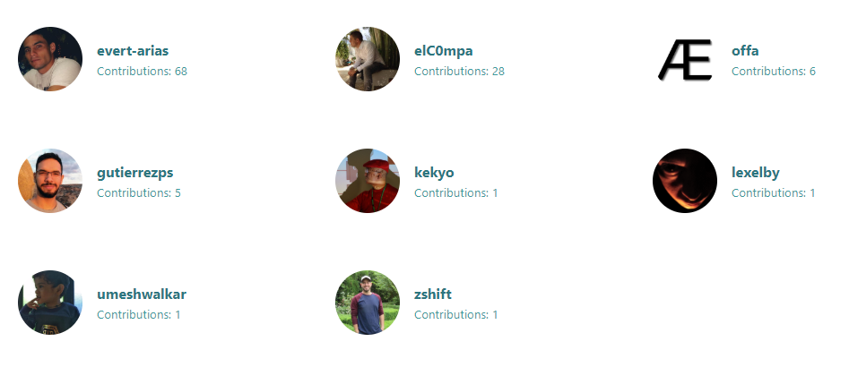

# react-contributors

> Small and simple React component to display a fully responsive list of your project's contributors with info gathered from their GitHub profile.

[](https://www.npmjs.com/package/react-contributors) [](https://standardjs.com)

## Demo

Live demo: https://evert-arias.github.io/react-contributors/



## Install

```bash
npm install --save react-contributors
```

## Usage

```jsx
import React, { Component } from "react";

import Contributors from "react-contributors";

// Username of the repo(s) owner.
const owner = "evert-arias";

// Repository name or array with multiple repositories names.
const repos = ["EasyButton", "easybtn.earias.me"];

class App extends Component {
  render() {
    return <Contributors owner={owner} repo={repos} />;
  }
}
```

You must pass the following two props to the component:

**owner**: Username of the repo(s) owner.

**repo**: Repository name or array with multiple repositories names

## License

MIT © [Evert Arias](https://github.com/evert-arias)
